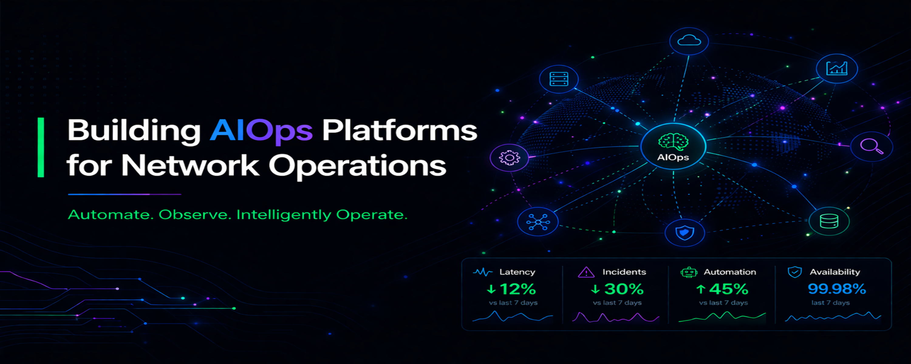

<h1 align="center">Walter Rodrigues 🧑‍💻</h1>

<h3 align="center">
Building Intelligent AIOps Platforms for Network Operations
</h3>

Automate. Observe. Intelligently Operate.

## 🧠 About Me

I design and lead the development of intelligent platforms for network operations (NOC/SOC),  focusing on automation, observability and AI-driven troubleshooting.

---

## 🚀 Featured Projects

### 🧩 open-noc-ai

🚀 Open Source AIOps platform designed to automate and scale real-world NOC/SOC operations

✔ Multi-agent architecture  
✔ Network automation (DevNet)  
✔ LLM-based troubleshooting  
✔ Observability and compliance  

---

### 🧠 net-noc-ai

Research and development of specialized LLMs for network operations

✔ LLM fine-tuning for networking  
✔ AI agents for NOC operations  
✔ RAG and knowledge base  

---

### ⚙️ CAQ Platform

Automation and quality platform for large-scale network deployment

✔ Process automation  
✔ Compliance validation  
✔ Integration with network inventory  
✔ Reporting and dashboards  

---

## ⚙️ Tech Stack

**Networking**  
Cisco • Fortinet • TCP/IP • Routing • Switching  

**Automation**  
Python • APIs • Flask • DevNet  

**AI / AIOps**  
LLMs • Ollama • OpenAI • NLP • RAG  

**Data & Observability**  
MySQL • Power BI • Monitoring • Metrics  

---

## 📈 Impact

✔ Reducing manual network operations  
✔ Improving incident response with AI-driven analysis  
✔ Enabling scalable NOC/SOC automation  
✔ Increasing operational consistency and reliability  

---

## 🧭 Journey

From Network Engineer to AIOps Architect — building automation, observability and intelligent systems for modern network operations.

---

