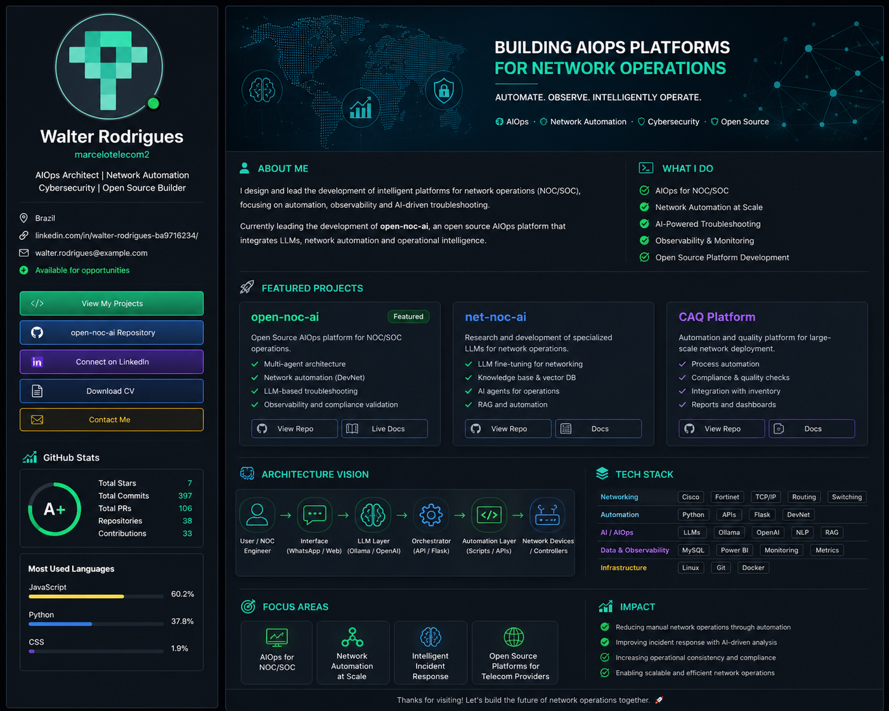

  

  
  
  

---

## Walter Rodrigues

**AIOps Architect | Network Automation | Cybersecurity | Open Source Builder**

I design intelligent platforms for **NOC/SOC operations**, combining network automation, observability, cybersecurity and AI-driven troubleshooting.

### Current Focus

- Building `open-noc-ai`
- Designing AIOps architectures for network operations
- Developing specialized LLMs for networking
- Creating open source tools for NOC/SOC environments

---

  Building the future of network operations 🚀

