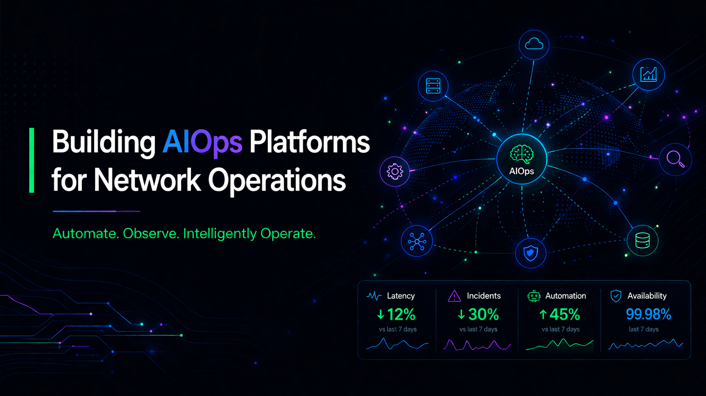

<table>
<tr>

<!-- SIDEBAR -->
<td width="25%" valign="top">

  

<h2 align="center">Walter Rodrigues</h2>

<code>marcelotelecom2</code>

AIOps Architect 
Network Automation 
Cybersecurity 
Open Source Builder

---

### 📍 Profile

- 🌎 Brazil  
- 🔗 [LinkedIn](https://www.linkedin.com/in/walter-rodrigues-b89716234/)  
- ✉️ walter.rodrigues@example.com  
- 🟢 Available for opportunities  

---

---

### 📊 Stats

</td>

<!-- MAIN AREA -->
<td width="75%" valign="top">

  

<table>
<tr>

<td width="65%" valign="top">

## 🧠 ABOUT ME

I design and lead the development of intelligent platforms for network operations (NOC/SOC),  
focusing on automation, observability and AI-driven troubleshooting.

Currently leading the development of **open-noc-ai**, an open source AIOps platform that integrates LLMs, network automation and operational intelligence.

</td>

<td width="35%" valign="top">

## ⚡ WHAT I DO

- ✔ AIOps for NOC/SOC  
- ✔ Network Automation at Scale  
- ✔ AI-Powered Troubleshooting  
- ✔ Observability & Monitoring  
- ✔ Open Source Development  

</td>

</tr>
</table>

---

## 🚀 FEATURED PROJECTS

<table>
<tr>

<td width="33%" valign="top">

### 🧩 open-noc-ai

Open Source AIOps platform  

- ✔ Multi-agent architecture  
- ✔ Network automation  
- ✔ LLM troubleshooting  
- ✔ Observability  

</td>

<td width="33%" valign="top">

### 🧠 net-noc-ai

LLM platform for network ops  

- ✔ Fine-tuning  
- ✔ Knowledge base  
- ✔ AI agents  
- ✔ RAG  

</td>

<td width="33%" valign="top">

### ⚙️ CAQ Platform

Automation & Quality  

- ✔ Compliance  
- ✔ Dashboards  
- ✔ Integration  
- ✔ Reports  

</td>

</tr>
</table>

---

## 🧩 ARCHITECTURE

<table>
<tr>
<td align="center">👤 User</td>
<td align="center">➡️</td>
<td align="center">💬 Interface</td>
<td align="center">➡️</td>
<td align="center">🧠 LLM</td>
<td align="center">➡️</td>
<td align="center">⚙️ Orchestrator</td>
<td align="center">➡️</td>
<td align="center">💻 Automation</td>
<td align="center">➡️</td>
<td align="center">🌐 Devices</td>
</tr>
</table>

---

<table>
<tr>

<td width="50%" valign="top">

## 🎯 FOCUS

- AIOps for NOC/SOC  
- Network automation at scale  
- Intelligent incident response  
- Open source platforms  

</td>

<td width="50%" valign="top">

## ⚙️ TECH STACK

**Networking**  
Cisco • Fortinet • TCP/IP  

**Automation**  
Python • APIs • Flask  

**AI / AIOps**  
LLMs • Ollama • RAG  

**Data**  
MySQL • Power BI  

**Infra**  
Linux • Docker  

</td>

</tr>
</table>

---

## 📈 IMPACT

- ✔ Reducing manual operations  
- ✔ Faster incident response  
- ✔ Standardization & compliance  
- ✔ Scalable operations  

---

🚀 Let's build the future of network operations

</td>
</tr>
</table>
